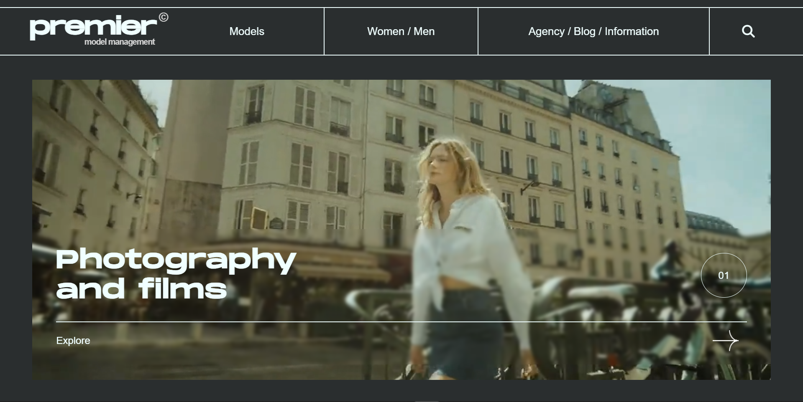
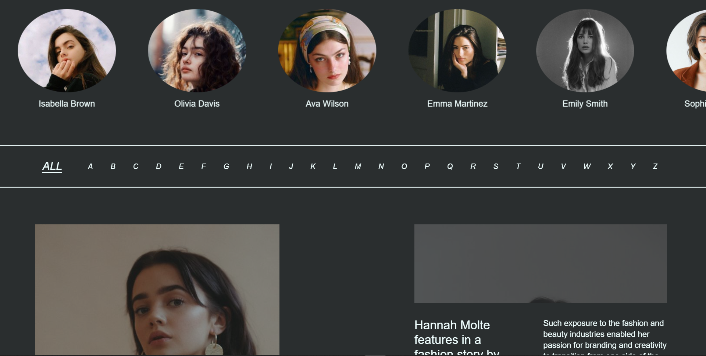

# Premier

## [🔗 Visit the Website](https://tanaymo7.github.io/Premier-web-ui/)

This website is a learning task inspired by the UI design found on Behance, created by the talented designer "Set Redesign". It was developed with the guidance of Sheryians Coding School.

## Overview
'Premier' is a modern and visually appealing website aimed at showcasing various design elements and portfolio pieces. It incorporates a sleek design with smooth animations to create an engaging user experience.

- **Smooth Animations**: Utilizes GSAP (GreenSock Animation Platform) for smooth and interactive animations throughout the website, enhancing user engagement.
- **Locomotive Scroll Integration**: Implements Locomotive Scroll library to create a smooth scrolling effect, enhancing the overall navigation experience.

## Technologies Used
- HTML5
- CSS3 (including SCSS)
- JavaScript
- GSAP (GreenSock Animation Platform)
- Locomotive Scroll

## Getting Started

To run the Set Redesign Website locally on your machine, follow these steps:

1. Clone this repository to your local machine using `git clone`.
2. Navigate to the project directory.
3. Open the `index.html` file in your web browser.

## Credits

- UI Design Inspiration: [Set Redesign Behance]([https://www.behance.net/gallery/xxxxxxx/Set-Redesign](https://www.behance.net/gallery/97376811/Premier))
- Developed by: Tanay
- Sheryian's youtube channel: [Sheryians Coding School]([https://www.example.com](https://www.youtube.com/@thesheryianscodingschool))

## License

This project is licensed under the [MIT License](LICENSE).
